# Project 10 – Virtualized Cybersecurity Home Lab with Active Directory, Windows Server 2022, Kali Linux, Splunk & Sysmon
 


 
---
 
## Overview
 
This project documents the build of a fully functional virtualized cybersecurity home lab from scratch following the **MyDFIR YouTube series**. The lab includes a **Windows Server 2022 Domain Controller** with Active Directory Domain Services, a **Kali Linux** attacker machine, a **Splunk SIEM server** on Ubuntu, and internal networking between all VMs — creating a safe, self-contained environment for security research, attack simulation, and log analysis. This lab serves as the foundation for all future offensive and defensive cybersecurity projects.
 
---
 
## Environment
 
| Tool | Purpose |
|------|---------|
| Oracle VirtualBox | VM hypervisor and network configuration |
| Windows Server 2022 (Evaluation) | Domain Controller with Active Directory |
| Kali Linux 2026.1 | Attacker and security testing machine |
| Ubuntu 24.04 LTS | Splunk SIEM server host |
| Splunk Enterprise 10.2.3 | Log aggregation and security event analysis |
| Sysmon v15.20 | Advanced Windows telemetry collection |
| Splunk Universal Forwarder | Ships Windows logs to Splunk server |
| Active Directory Domain Services | Domain management, OUs, users, and groups |
| VirtualBox NAT Network (AD-Project) | Internal network — 192.168.10.0/24 |
| GitHub | Documentation and version control |
 
---
 
## Lab Architecture
 
### Virtual Machines
 
| VM | OS | RAM | Disk | Role |
|----|-----|-----|------|------|
| WindowsServer2022 | Windows Server 2022 (64-bit) | 4096 MB | 60 GB | Domain Controller + Sysmon + Forwarder |
| kali-linux-2026.1 | Kali Linux | 2048 MB | 20 GB | Attacker Machine |
| Splunk | Ubuntu 24.04 LTS | — | 97.87 GB | SIEM / Log Aggregation Server |
 
### Network Configuration
 
| VM | Network Type | IP Address | Role |
|----|-------------|-----------|------|
| WindowsServer2022 | NAT Network (AD-Project) | 192.168.10.4 | Domain Controller |
| Kali Linux | NAT Network (AD-Project) | 192.168.10.x | Attacker |
| Splunk Ubuntu | NAT Network (AD-Project) | 192.168.10.10 (static) | SIEM Server |
 
### Active Directory Design
 
| Component | Value |
|-----------|-------|
| Domain Name | lab.local |
| Organizational Unit | Employees |
| Users Created | Allen Garcia, David Carter, Jaden Miller, Nasir Banks, Sydney Jones |
 
### Telemetry Flow
 
```
Windows Server 2022
  └── Sysmon (captures detailed event telemetry)
  └── Splunk Universal Forwarder (ships logs on port 9997)
        └──► Splunk Server (Ubuntu 192.168.10.10:9997)
                └── index=endpoint (search and analyze events)
```
 
---
 
## Build Walkthrough
 
---
 
### 🟡 Step 1 — Provisioned Windows Server 2022 VM in VirtualBox
 
Created a new Virtual Machine in VirtualBox for Windows Server 2022. Configured hardware allocation — 4096 MB RAM, 2 processors, 60 GB dynamic hard disk — and mounted the Windows Server 2022 Evaluation ISO. Completed the Windows Server installation with Desktop Experience.
 
**VM Configuration:**
- VM Name: WindowsServer2022
- Guest OS: Windows Server 2022 (64-bit)
- Base Memory: 4096 MB
- Processors: 2
- Hard Disk: 60 GB
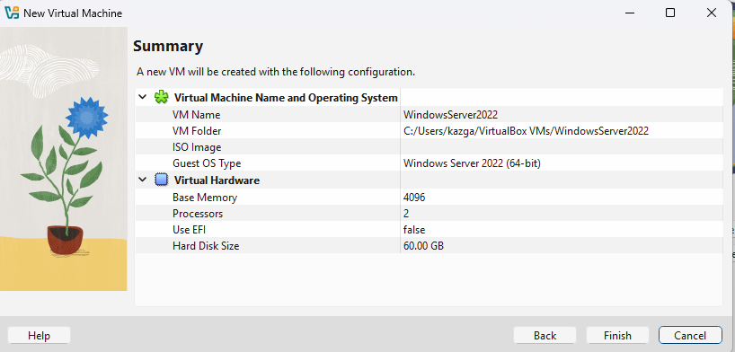
*VirtualBox New VM Summary — WindowsServer2022 configured with 4GB RAM, 2 CPUs, 60GB disk*
 
---
 
### 🔵 Step 2 — Installed Active Directory Domain Services
 
Opened Server Manager and launched the Add Roles and Features Wizard. Selected Active Directory Domain Services and all required Remote Server Administration Tools. Installation completed successfully. Promoted the server to a Domain Controller with domain name **lab.local**.
 
**Roles Installed:**
- Active Directory Domain Services
- Group Policy Management
- AD DS and AD LDS Tools
- Active Directory module for Windows PowerShell
- Active Directory Administrative Center
- AD DS Snap-Ins and Command-Line Tools
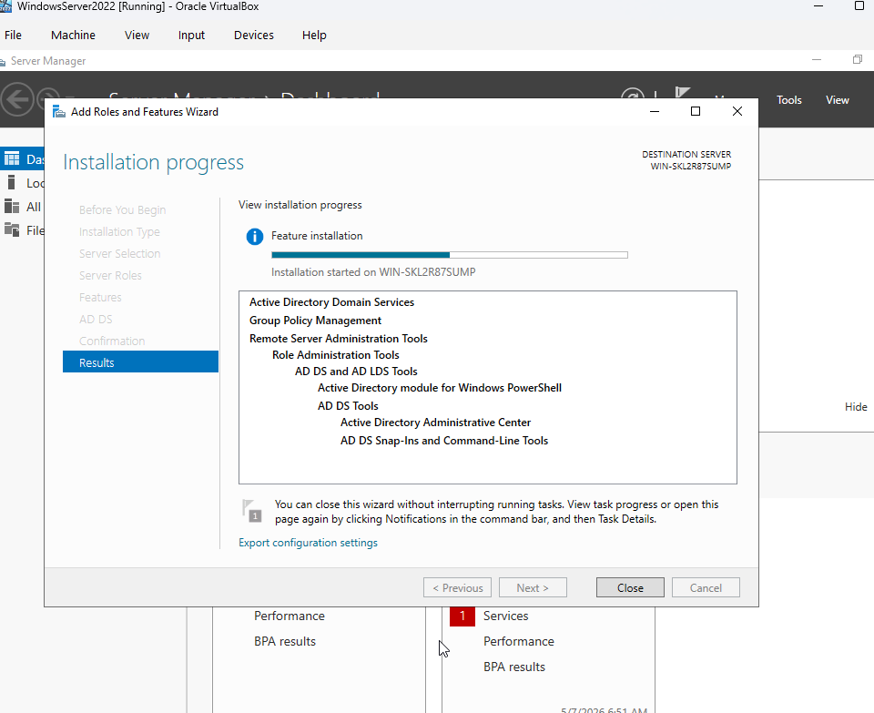
*Add Roles and Features Wizard — AD DS installation completed successfully on WIN-SKL2R87SUMP*
 
---
 
### 🔵 Step 3 — Created OU and User Accounts in Active Directory
 
Opened Active Directory Users and Computers and created an Organizational Unit named **Employees** under lab.local. Created five fictional user accounts within the OU — each configured with passwords.
 
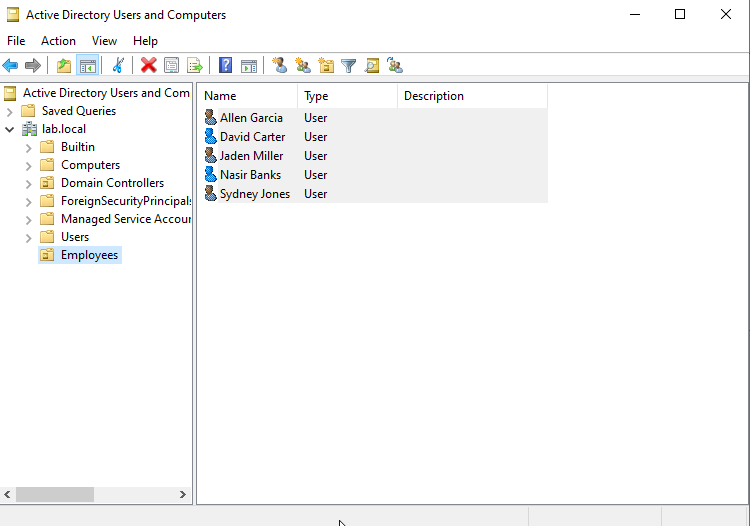
*Active Directory Users and Computers — Employees OU with 5 user accounts confirmed under lab.local*
 
---
 
### 🟠 Step 4 — Configured Host-Only Network Adapters on Both VMs
 
Enabled Adapter 2 as a Host-Only Adapter on both the WindowsServer2022 and Kali Linux VMs to create an isolated internal network segment.
 
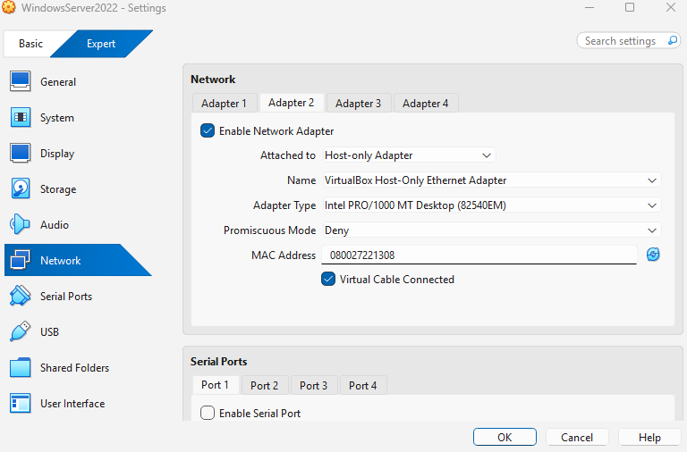
*WindowsServer2022 — Adapter 2 configured as Host-Only Ethernet Adapter*
 
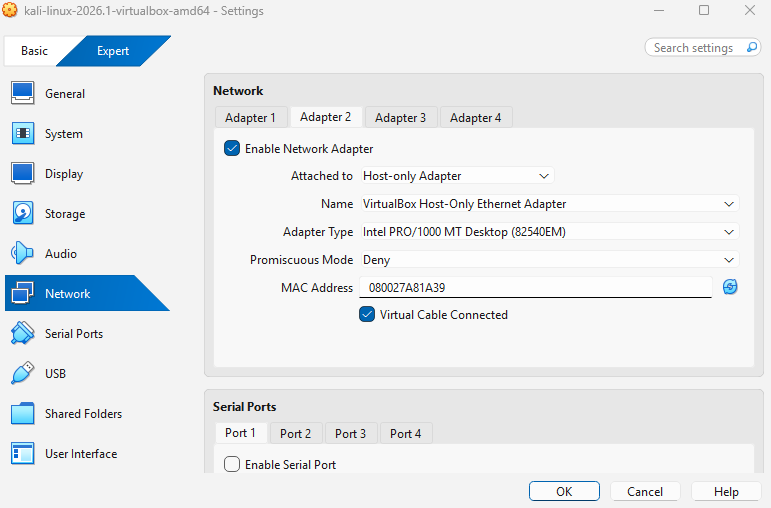
*Kali Linux — Adapter 2 configured as Host-Only Ethernet Adapter*
 
---
 
### 🟠 Step 5 — Verified IP Configuration on Both VMs
 
Confirmed both VMs received Host-Only IPs on the 192.168.56.0/24 segment.
 
**IP Addresses:**
- Windows Server Host-Only: `192.168.56.101`
- Kali Linux Host-Only: `192.168.56.102`
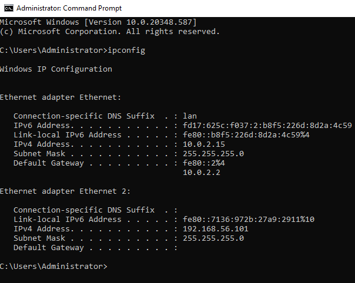
*Windows Server ipconfig — Host-Only adapter confirmed at 192.168.56.101*
 
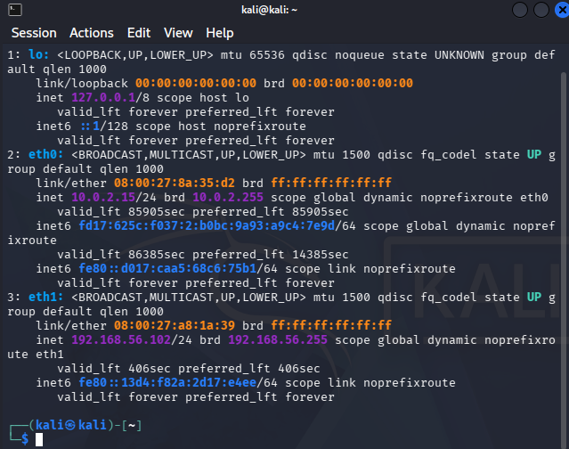
*Kali Linux ip a — eth1 confirmed at 192.168.56.102*
 
---
 
### 🟢 Step 6 — Verified VM-to-VM Connectivity via Ping
 
Pinged Windows Server (192.168.56.101) from Kali Linux. All packets returned with 100% success, TTL 128, avg ~0.25ms — confirming the internal lab network is fully operational.
 
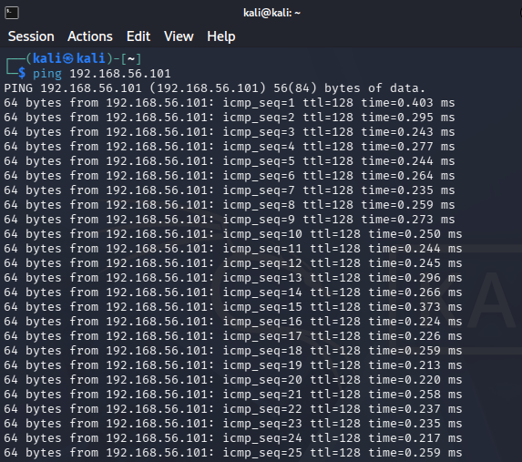
*Kali Linux pinging 192.168.56.101 — continuous successful replies confirming VM-to-VM connectivity*
 
---
 
### ✅ Step 7 — Confirmed Both VMs Running
 
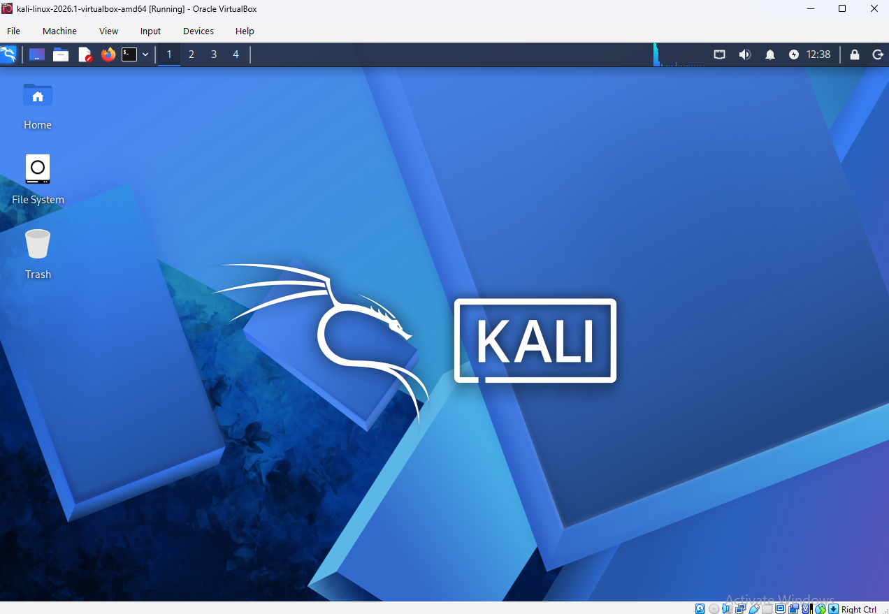
*Kali Linux 2026.1 desktop running in VirtualBox*
 
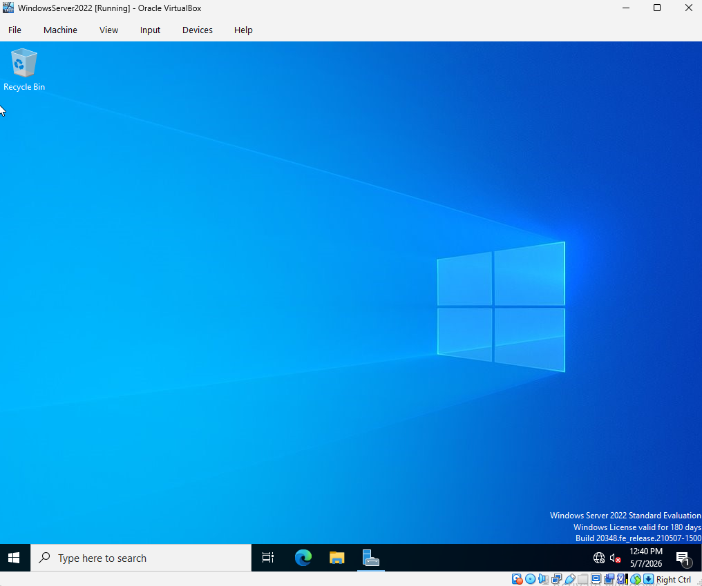
*Windows Server 2022 Standard Evaluation desktop running in VirtualBox*
 
---
 
### 🟣 Step 8 — Created NAT Network and Configured Static IP on Splunk VM
 
Created a NAT Network named **AD-Project** in VirtualBox with prefix `192.168.10.0/24` and DHCP enabled. Attached all VMs to this network. Configured a static IP of `192.168.10.10` on the Ubuntu Splunk VM using `sudo nano /etc/netplan/` and ran `sudo netplan apply`. Verified connectivity by pinging google.com successfully.
 
**Splunk VM Static IP Config:**
- IP: 192.168.10.10/24
- Gateway: 192.168.10.1
- DNS: 8.8.8.8
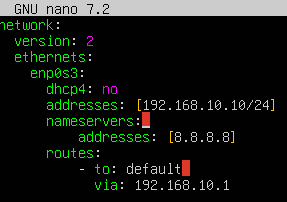
*Ubuntu netplan configuration — static IP 192.168.10.10 set for Splunk server*
 
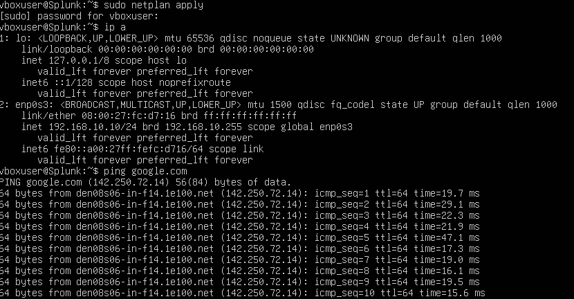
*ip a showing 192.168.10.10 confirmed, ping google.com successful*
 
---
 
### 🟣 Step 9 — Installed Splunk Enterprise on Ubuntu
 
Downloaded Splunk Enterprise 10.2.3 `.deb` package directly to the Ubuntu VM using `wget`. Installed with `sudo dpkg -i splunk.deb`. Started Splunk as the splunk user and created admin credentials. Enabled boot-start so Splunk automatically starts on reboot.
 
**Commands used:**
```bash
sudo dpkg -i splunk.deb
sudo -u splunk bash
cd /opt/splunk/bin
./splunk start
exit
cd /opt/splunk/bin
sudo ./splunk enable boot-start -user splunk
```
 
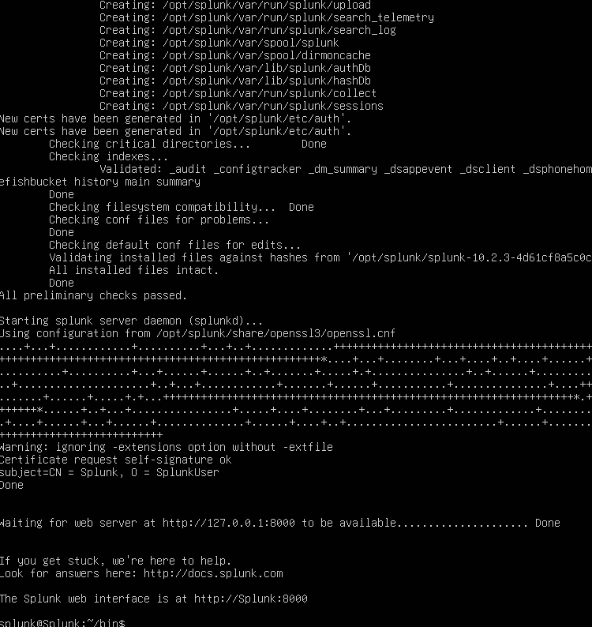
*Splunk 10.2.3 installed and started — web interface available at http://Splunk:8000*
 
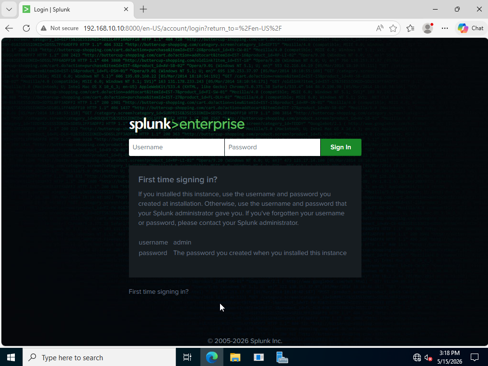
*Splunk boot-start enabled — Init script configured to run at boot*
 
---
 
### 🟣 Step 10 — Accessed Splunk Web UI and Configured Receiving
 
Accessed the Splunk web interface at `http://192.168.10.10:8000` from the Windows Server browser. Logged in with admin credentials. Created the **endpoint** index under Settings → Indexes. Configured receiving port **9997** under Settings → Forwarding and Receiving → Configure Receiving.
 
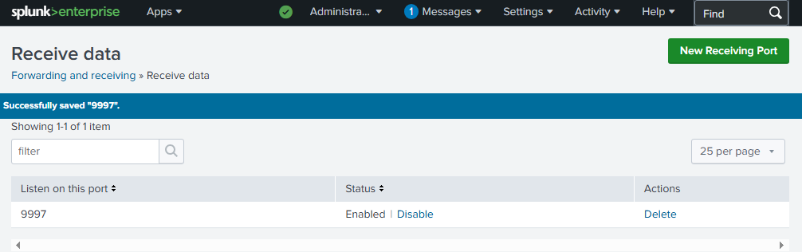
*Splunk Enterprise 10.2.3 web UI login page — accessible at 192.168.10.10:8000*
 
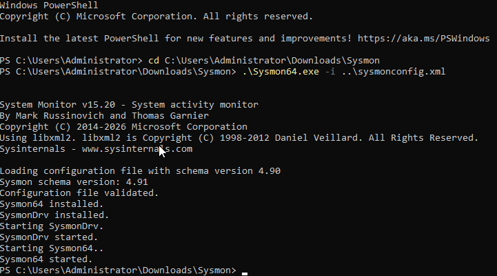
*Splunk receiving port 9997 — Successfully saved and Enabled*
 
---
 
### 🟣 Step 11 — Installed Sysmon on Windows Server with Olaf Config
 
Downloaded Sysmon v15.20 from Microsoft Sysinternals and the Olaf sysmonconfig.xml from GitHub. Extracted the Sysmon zip, navigated to the folder in PowerShell as Administrator, and installed with the configuration file.
 
**Command used:**
```powershell
cd C:\Users\Administrator\Downloads\Sysmon
.\Sysmon64.exe -i ..\sysmonconfig.xml
```
 
**Results:**
- Configuration file validated (schema 4.90/4.91)
- Sysmon64 installed
- SysmonDrv installed and started
- Sysmon64 started
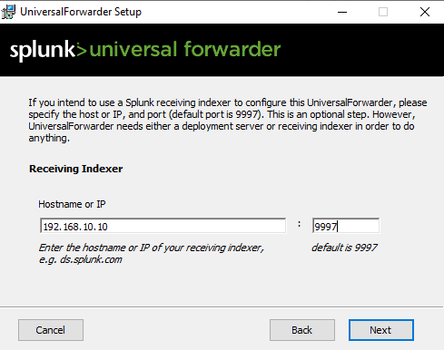
*PowerShell — Sysmon64 installed and started with Olaf configuration file*
 
---

### 🟣 Step 12 — Configured inputs.conf and outputs.conf
 
Created `inputs.conf` and `outputs.conf` in the Splunk Universal Forwarder local directory using PowerShell as Administrator. These files instruct the forwarder what logs to collect and where to send them.
 
**inputs.conf — log sources configured:**
```
[WinEventLog://Application]
index = endpoint
disabled = false
 
[WinEventLog://Security]
index = endpoint
disabled = false
 
[WinEventLog://System]
index = endpoint
disabled = false
 
[WinEventLog://Microsoft-Windows-Sysmon/Operational]
index = endpoint
disabled = false
```
 
**outputs.conf — destination:**
```
[tcpout]
defaultGroup = default-autolb-group
 
[tcpout:default-autolb-group]
server = 192.168.10.10:9997
```
 
**File location:**
```
C:\Program Files\SplunkUniversalForwarder\etc\system\local\
```
 
---
 
### ✅ Step 14 — Verified Logs Flowing into Splunk
 
Restarted the SplunkForwarder service in Windows Services (set Log On as Local System Account). Confirmed Sysmon64 and SplunkForwarder both showing Running status. Searched `index=endpoint` in Splunk Search and Reporting — **203 events confirmed** flowing from Windows Server including System, Security, Application, and Sysmon logs.
 
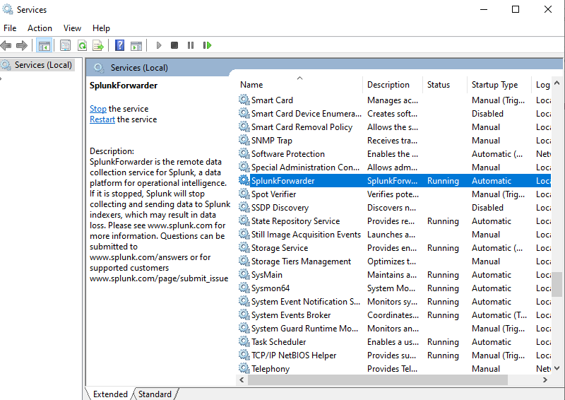
*Windows Services — SplunkForwarder Running (Automatic) and Sysmon64 Running confirmed*
 
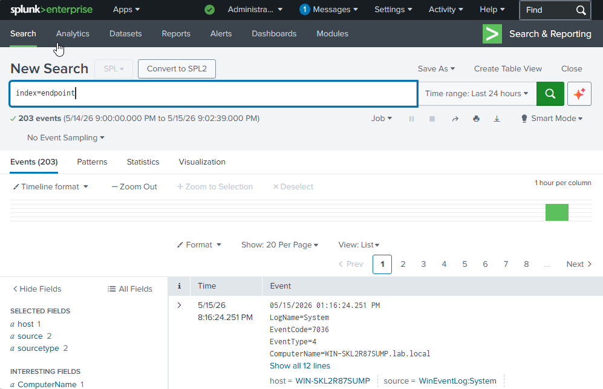
*Splunk Search — index=endpoint returning 203 events from host WIN-SKL2R87SUMP.lab.local*


### 🔴 Step 15 — Kali Linux Brute Force Attack Detected in Splunk

Installed **Crowbar** on Kali Linux and used it to perform a brute force attack against the Windows Server RDP service on port 3389. Multiple failed authentication attempts were generated targeting the Administrator account from Kali Linux (`192.168.10.5`).

Splunk detected the attack in real time via the Security event log. Searching `index=endpoint EventCode=4625` returned multiple failed logon events. Expanding an event confirmed the attacker identity — **Workstation Name: kali**, **Source Network Address: 192.168.10.5**, targeting **Account Name: Administrator** with failure reason **Unknown user name or bad password**.

**Attack details captured by Splunk:**
- EventCode: 4625 (Failed Logon)
- Target Account: Administrator
- Workstation Name: kali
- Source IP: 192.168.10.5
- Logon Type: 3 (Network)
- Authentication Package: NTLM

**Crowbar command used:**
```bash
crowbar -b rdp -s 192.168.10.4/32 -u Administrator -C ~/passwords.txt -n 1 -v
```

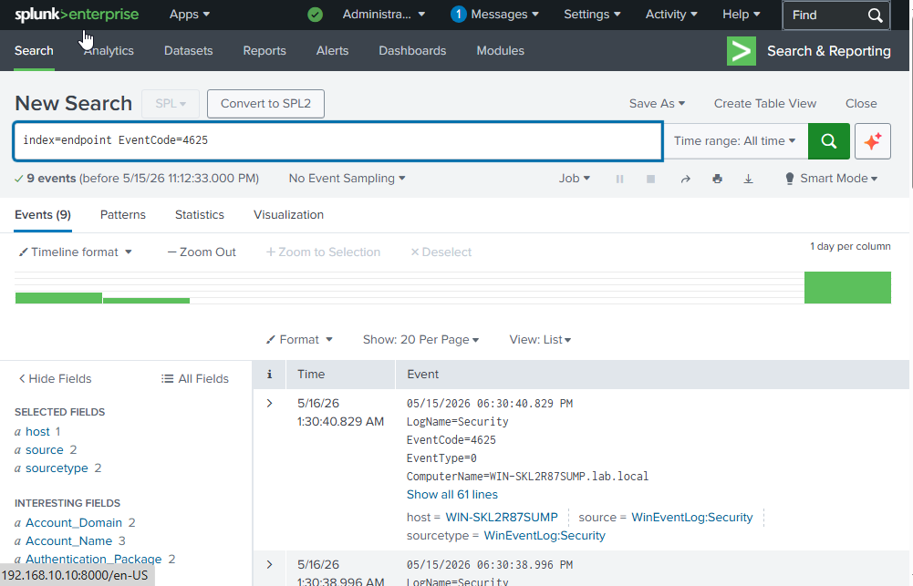
*Splunk Search — index=endpoint EventCode=4625 returning multiple failed logon events from Kali*

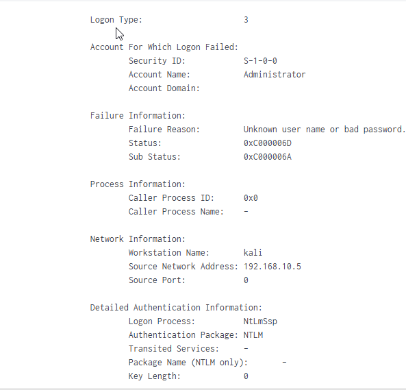
*Splunk expanded event — Workstation Name: kali, Source: 192.168.10.5 attacking Administrator account*
 
---
 
## Current Lab Status
 
| Component | Status |
|-----------|--------|
| Windows Server 2022 VM | ✅ Running |
| Kali Linux VM | ✅ Running |
| Splunk Ubuntu VM | ✅ Running |
| Active Directory Domain Services | ✅ Installed and promoted |
| Domain (lab.local) | ✅ Active |
| Employees OU + Users | ✅ Created |
| NAT Network (AD-Project) | ✅ Configured on all VMs |
| VM-to-VM Connectivity | ✅ Verified via ping |
| Splunk Enterprise | ✅ Installed and running |
| Splunk Static IP | ✅ 192.168.10.10 |
| Sysmon | ✅ Installed with Olaf config |
| Splunk Universal Forwarder | ✅ Installed and running |
| Log Ingestion (index=endpoint) | ✅ 203 events confirmed |
 
---
 
## Skills Demonstrated
 
| Skill | How It Was Applied |
|-------|--------------------|
| VM Provisioning | Built and configured three VMs from ISO in VirtualBox |
| Windows Server Administration | Installed roles, promoted DC, managed Server Manager |
| Active Directory | Created domain, OU structure, and user accounts |
| Linux Administration | Configured static IP via netplan, installed packages via apt/dpkg |
| VM Networking | Configured NAT Network for full VM-to-VM communication |
| SIEM Deployment | Installed and configured Splunk Enterprise on Ubuntu |
| Log Forwarding | Configured Splunk Universal Forwarder with inputs.conf and outputs.conf |
| Endpoint Telemetry | Deployed Sysmon with Olaf config for advanced Windows event logging |
| Network Verification | Confirmed IP assignments and VM-to-VM connectivity via ping |
| Linux CLI | Used ip a, ping, wget, dpkg, netplan, ss to configure and verify |
| Windows PowerShell | Used Set-Content, Get-Content to create and verify config files |
| Lab Documentation | Documented full architecture, IPs, configs, and build steps |
 
---
 
## Lessons Learned
 
**A home lab is not optional — it is your proof of work.** Every cybersecurity skill worth having requires a safe place to practice it. Active Directory attacks, SIEM log collection, network scanning, and malware analysis all require real systems to work against. Without a lab, you are studying theory. With a lab, you are building experience.
 
**SIEM configuration requires end-to-end thinking.** Getting logs into Splunk requires every layer to be correct — the index must exist, the receiving port must be open, the forwarder must know where to send data, and the inputs must be defined. Debugging the full pipeline — from `ss -tlnp` on Ubuntu to reading `splunkd.log` on Windows — is the same process a SOC analyst uses to troubleshoot a broken data pipeline in production.
 
**Sysmon dramatically improves Windows visibility.** Default Windows Event Logs miss most of what attackers do. Sysmon with a quality configuration like Olaf's captures process creation, network connections, file creation, and registry changes — the exact telemetry needed to detect real attacks. Deploying it as part of lab setup builds the habit of treating endpoint visibility as a baseline requirement, not an optional add-on.
 
**Active Directory is the backbone of enterprise Windows environments.** Every organization running Windows uses AD for authentication, group policy, and access control. Building it from scratch gives you direct experience with the system that attackers target most in real-world breaches.
 
---
 
## 💼 Real-World Application
 
This lab now mirrors a basic enterprise SOC environment — a Windows domain, endpoint telemetry via Sysmon, and a SIEM collecting and indexing events. Blue teamers use this stack to practice detection and response. Red teamers use it to simulate credential attacks and lateral movement. Security analysts investigate these exact log sources in every Windows-based incident. Building and troubleshooting this stack from scratch demonstrates the technical initiative and foundational competency that hiring managers across all cybersecurity roles look for in entry-level candidates.
 
---
 
## References
 
- [MyDFIR Step 1 — Home Lab Foundation](https://www.youtube.com/watch?v=kku0fVfksrk)
- [MyDFIR Step 2 — Expanding the Lab](https://www.youtube.com/watch?v=5iafC6vj7kM)
- [MyDFIR Step 3 — Finalizing the Lab](https://www.youtube.com/watch?v=-8X7Ay4YCoA)
- [MyDFIR Part 3 — Sysmon and Splunk](https://www.youtube.com/watch?v=uXRxoPKX65Q)
- [Full MyDFIR Home Lab Playlist](https://www.youtube.com/playlist?list=PLG6KGSNK4PuBWmX9NykU0wnWamjxdKhDJ)
- [VirtualBox Download](https://www.virtualbox.org)
- [Windows Server 2022 Evaluation](https://www.microsoft.com/en-us/evalcenter/evaluate-windows-server-2022)
- [Kali Linux Download](https://www.kali.org/get-kali/)
- [Splunk Enterprise Download](https://www.splunk.com/en_us/download/splunk-enterprise.html)
- [Sysmon Download](https://learn.microsoft.com/en-us/sysinternals/downloads/sysmon)
- [Olaf Sysmon Config](https://github.com/olafhartong/sysmon-modular)
 
